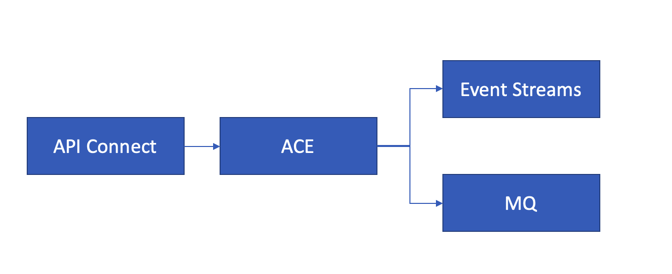
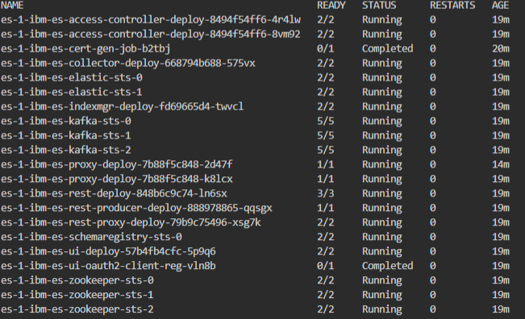
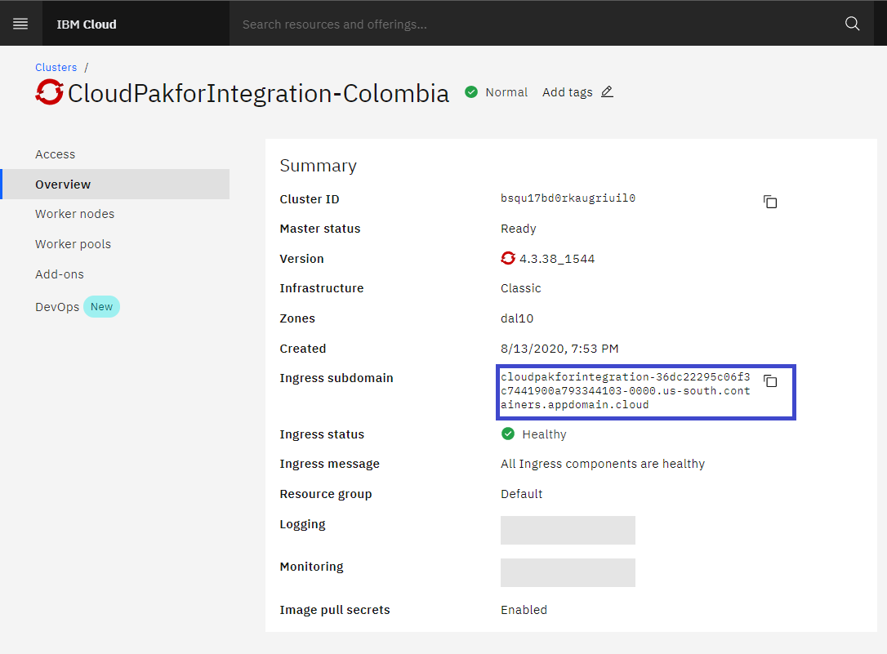

# <h1 align=center> IBM Cloud Pak for Integration 2020.1.1.

A partir de la guía expuesta en el [playbook](https://cloudpak8s.io/integration/cp4i-scenario-2020.1.x/), este documento busca ilustrar los pasos realizados con una descripción detallada sobre los errores y complicaciones a lo largo del proceso de creación de la demostración.

Para la ejecución de los comandos se utilizó el [IBM Cloud Shell](https://cloud.ibm.com/shell) con acceso al cluster donde está instalado el Cloud Pak for Integration.

El escenario consiste en unir las capacidades del Cloud Pak for Integration, APIC, ACE, MQ y Event Streams simulando el flujo de integración en el procesamiento de ordenes en una compañia.



---

En el ambiente no se tenía la instancia de Event Streams, se instaló siguiendo los siguientes pasos.

### Instalación de Event Streams

#### Preparando la instalación

1. Se pudo ejecutar sin ningún problema

2. En el paso 2, no se especifica la forma en la que se pueden ejecutar los comandos en los nodos del cluster. En el dashboard de Openshift tampoco se encontró la forma de acceder a un terminal que esté direccionado al nodo.

3. No hubo problema al ejecutar los comandos.

#### Comenzando la instalación

Antes de iniciar se nos pide especificar un Group ID para el Sistema de Archivos (File System Group ID) con un valor de 1000. Sin embargo, no es claro la forma en la que se configura este valor.

Se colocaron los valores de acuerdo a la guía del Playbook, en la siguiente tabla están los valores usados para la instalación.

| Configuración                                       | Valor usado   |
| --------------------------------------------------- | ------------- |
| Helm Release Name                                   | es-1          |
| Target Namespace                                    | eventstreams  |
| Cluster                                             | local-cluster |
| License Agreement                                   | ✔️            |
| Namespace where the Platform Navigator is installed | integration   |

Expandir la sección **Quick Start**

| Configuración                    | Valor usado                                                                                                |
| -------------------------------- | ---------------------------------------------------------------------------------------------------------- |
| Certificate Secret Name          | eventstreamssecret                                                                                         |
| Image Pull Secret                | ibm-entitlement-key\*                                                                                      |
| External hostname/IP Address\*\* | icp-proxy.cloudpakforintegration-36dc22295c06f3c7441900a793344103-0000.us-south.containers.appdomain.cloud |

- La llave debe ser creada con anterioridad, se puede consultar el nombre de la llave usando el comando `oc get secrets`

\*\* dependiendo del ambiente la ruta cambia icp-proxy.<openshift-domain>

Expandir la sección **All Parameters**

| Configuración        | Valor usado     |
| -------------------- | --------------- |
| File System Group ID | 1000            |
| Persistent Storage   | ibmc-block-gold |

#### Validar la instalación

Utilizando el comando `oc get pods` teniendo seleccionado el proyecto eventstreams mostró la correcta inicialización de la instancia en el Cloud Pak.



---

### Instalación API Connect Enterprise

#### Creación de Endpoints

Los endpoints utilizados para la instalación fueron los siguientes

**Nota**: Cada valor debe tener el sufijo icp-proxy.cloudpakforintegration-36dc22295c06f3c7441900a793344103-0000.us-south.containers.appdomain.cloud, en este caso. Para replicar en otros ambientes el sufijo es el Ingress Domain que puede ser encontrado en la interfaz del cluster de IBM Cloud.



| Endpoint            | Valor   |
| ------------------- | ------- |
| API Manager UI      | mgmt    |
| Cloud Admin UI      | mcadmin |
| Platform API        | mpapi   |
| Consumer API        | mcapi   |
| API Gateway         | gw      |
| Gateway Service     | gwd     |
| Analytics Client    | ac      |
| Analytics Ingestion | ai      |
| Portal              | portal  |
| Portal Director     | padmin  |

#### Creación del pull secret

**Para una instalación online** es necesario que nuestro cluster descarge las imagenes del registro de imagenes de IBM, se debe crear un secret con la IBM Entitlement Key.

1. Obtener la IBM Entitlement Key alojado en la [IBM Container Library](https://myibm.ibm.com/products-services/containerlibrary)
2. Validar la llave haciendo login en el registro

```sh
docker login cp.icr.io --username cp --password <entitlement key>
```

3. Crear el pull secret con el comando: `kubectl create secret docker-registry ibm-entitlement-key --docker-username=cp --docker-password=<entitlement key> --docker-server=cp.icr.io`

**Nota**: El nombre del secret es el que se coloca en la interfaz de creación de la instancia, en este caso **ibm-entitlement-key**. Dado el caso en el que no se acuerde del nombre, puede utilizar el comando `oc get secret -n <namespace>`

**Lección aprendida**: Usando la llave ibm-entitlement-key apareció error cuando intentaba obtener la imagen del registro. En la documentación se encontró que es recomendable actualizar el valor de la llave con los siguientes pasos:

1. En el Dashboard de OpenShift seleccionar el proyecto **apic**
2. En el panel izquierdo seleccionar **Workloads > Secrets**
3. Seleccionar el secret creado anteriormente, **ibm-entitlement-key** luego **Actions** > **Edit Secret** > **Add Credentials**
4. En el campo **Registry Server Address** colocar el valor **cp.icr.io**
5. Definir el **usuario** como **cp**
6. **Contraseña**, copiar y pegar la llave del [IBM Container Library](https://myibm.ibm.com/products-services/containerlibrary)

Los pods iniciaran el proceso de descarga de la imagen una vez más con la nueva llave, este proceso toma tiempo.

#### Creación de la instancia usando el Dashboard del Cloud Pak

En la siguiente tabla están los valores usados en el formulario para la creación de la instancia.

| Campo             | Valor         |
| ----------------- | ------------- |
| Helm release name | ibm-apic      |
| Target namespace  | apic          |
| Target Cluster    | local-cluster |

En la sección _All parameters_ se utilizaron los siguientes valores:

| Campo           | Valor             |
| --------------- | ----------------- |
| Storage Class   | ibmc-block-gold   |
| Helm TLS Secret | apic-ent-helm-tls |

Los siguientes campos son los endpoints descritos anteriormente y con esos campos se procede a instalar.

Luego de terminar la instaación, el servicio queda con advertencias para luego pasar a Not Running.

En la interfaz del navigator se puede ver la instancia creada pero cuando se quiere acceder se muestra el error:


